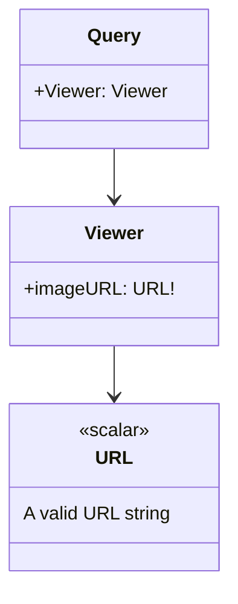

# README

This project reproduces an issue where the code generation creates a mock object that fails to compile when a required field with a custom scalar type is included in the schema.

```log
/apollo-playground/Tests/GraphQLMocks/Viewer+Mock.graphql.swift:19:32: error: no exact matches in call to initializer
17 | public extension Mock where O == Viewer {
18 |   convenience init(
19 |     imageURL: Demo.URL = try! .init(_jsonValue: "")
   |                                `- error: no exact matches in call to initializer
20 |   ) {
21 |     self.init()

Swift.String.init:2:19: note: incorrect labels for candidate (have: '(_jsonValue:)', expected: '(_:)')
1 | struct String {
2 | @inlinable public init<T>(_ value: T) where T : LosslessStringConvertible}
  |                   `- note: incorrect labels for candidate (have: '(_jsonValue:)', expected: '(_:)')
3 |

Swift.String.init:2:8: note: incorrect labels for candidate (have: '(_jsonValue:)', expected: '(_:)')
1 | struct String {
2 | public init<S>(_ other: S) where S : LosslessStringConvertible, S : Sequence, S.Element == Character}
  |        `- note: incorrect labels for candidate (have: '(_jsonValue:)', expected: '(_:)')
3 |

Swift.String.init:2:8: note: incorrect labels for candidate (have: '(_jsonValue:)', expected: '(_:)')
1 | struct String {
2 | public init<S>(_ characters: S) where S : Sequence, S.Element == Character}
  |        `- note: incorrect labels for candidate (have: '(_jsonValue:)', expected: '(_:)')
3 |

Swift.RangeReplaceableCollection.init:2:19: note: incorrect labels for candidate (have: '(_jsonValue:)', expected: '(_:)')
1 | protocol RangeReplaceableCollection {
2 | @inlinable public init<S>(_ elements: S) where S : Sequence, Self.Element == S.Element}
  |                   `- note: incorrect labels for candidate (have: '(_jsonValue:)', expected: '(_:)')
3 |
```

## Schema

> [!Note]
> The original schema is significantly larger. The included schema in this project is a minimized variant to reproduce the issue.



## Steps to reproduce

```shell
swift package --allow-writing-to-package-directory apollo-cli-install

./apollo-ios-cli generate

swift test
```
